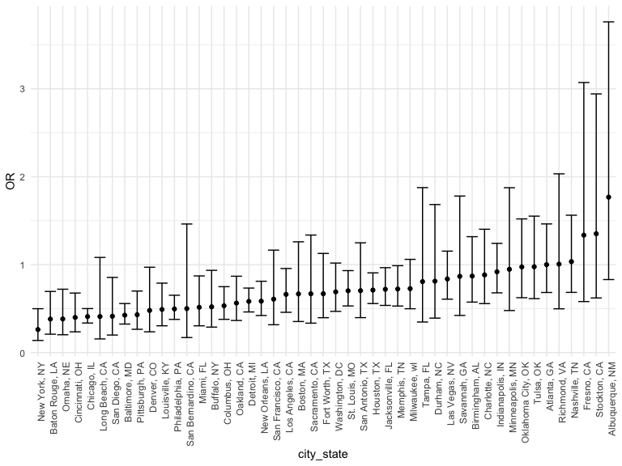

p8105_hw6_yz4720
================
Jasmine Zhang
2023-12-02

## Problem 1

### Data Import and Tidy

``` r
homicide_df = read_csv("./data/homicide-data.csv", na = c("", "NA", "Unknown")) |> 
  mutate(city_state = str_c(city, state, sep = ", "),
         victim_age = as.numeric(victim_age),
         resolution = case_when(disposition == "Closed without arrest" ~ 0,
                                disposition == "Open/No arrest" ~ 0,
                                disposition == "Closed by arrest" ~ 1)) |> 
  filter(!(city_state %in% c("Tulsa, AL", "Dallas, TX", "Phoenix, AZ", "Kansas City, MO")),
         victim_race %in% c("Black", "White")) |> 
  select(city_state, resolution, victim_age, victim_sex, victim_race)
```

### Baltimore, MD

``` r
baltimore_glm = filter(homicide_df, city_state == "Baltimore, MD") |> 
  glm(resolution ~ victim_age + victim_sex + victim_race, family = binomial(), data = _)
baltimore_glm |> 
  broom::tidy()|> 
  mutate(
    OR = exp(estimate), 
    OR_CI_upper = exp(estimate + 1.96 * std.error),
    OR_CI_lower = exp(estimate - 1.96 * std.error)) |> 
  filter(term == "victim_sexMale") |> 
  select(OR, OR_CI_lower, OR_CI_upper)
```

    ## # A tibble: 1 × 3
    ##      OR OR_CI_lower OR_CI_upper
    ##   <dbl>       <dbl>       <dbl>
    ## 1 0.426       0.325       0.558

### glm all cities

``` r
model_results = 
  homicide_df |> 
  nest(data = -city_state) |> 
  mutate(models = map(data, \(data) glm(resolution ~ victim_age + victim_sex + victim_race, 
                                        family = binomial(), data = data)),
         results = map(models, broom::tidy))  |> 
  select(-models, -data) |> 
  unnest(cols = results)|> 
  mutate(
    OR = exp(estimate), 
    OR_CI_upper = exp(estimate + 1.96 * std.error),
    OR_CI_lower = exp(estimate - 1.96 * std.error))|> 
  filter(term == "victim_sexMale") |> 
  select(city_state, OR, OR_CI_lower, OR_CI_upper) 
model_results |>
  slice(1:5) |> 
  knitr::kable(digits = 3)           
```

| city_state      |    OR | OR_CI_lower | OR_CI_upper |
|:----------------|------:|------------:|------------:|
| Albuquerque, NM | 1.767 |       0.831 |       3.761 |
| Atlanta, GA     | 1.000 |       0.684 |       1.463 |
| Baltimore, MD   | 0.426 |       0.325 |       0.558 |
| Baton Rouge, LA | 0.381 |       0.209 |       0.695 |
| Birmingham, AL  | 0.870 |       0.574 |       1.318 |

### plot: OR and CI for all cities

``` r
model_results |> 
  mutate(city_state = fct_reorder(city_state, OR)) |> 
  ggplot(aes(x = city_state, y = OR)) + 
  geom_point() + 
  geom_errorbar(aes(ymin = OR_CI_lower, ymax = OR_CI_upper)) + 
  theme(axis.text.x = element_text(angle = 90, hjust = 1))
```



The plot shows OR and CI for each city ordered by the magnitude of OR.
Most of the cities have OR less than 1, which means that crimes with
male victims have smaller odds of resolution compared to crimes with
female victims after adjusting for victim age and race. For cities with
CI that doesn’t include 1, it suggests a significant difference in
resolution rates by sex after adjustment for victim age and race.

## Problem 2

``` r
weather_df = 
  rnoaa::meteo_pull_monitors(
    c("USW00094728"),
    var = c("PRCP", "TMIN", "TMAX"), 
    date_min = "2022-01-01",
    date_max = "2022-12-31") |>
  mutate(
    name = recode(id, USW00094728 = "CentralPark_NY"),
    tmin = tmin / 10,
    tmax = tmax / 10) |>
  select(name, id, everything())
```

### bootstrap samples

``` r
boot_sample = function(df){ 
  sample_frac(df, replace = TRUE)
}

boot_results = tibble(strap_number = 1:5000) |>
  mutate(strap_sample = map(strap_number, \(i) boot_sample(weather_df)),
         models = map(strap_sample, \(df) lm(tmax~ tmin + prcp, data = df)),
         results_r_sq = map(models, broom::glance),
         results_coeff = map(models, broom::tidy))|> 
  select(-models, -strap_sample) 
```

### distribution of estimates r_squared and log(beta1\*beta2)

``` r
boot_results |> 
  unnest(cols1 = results_r_sq,
         cols2 = results_coeff) |>
  select(r.squared) |> 
  ggplot(aes(x = r.squared)) + 
  geom_density() + xlab("estimate of r.squared") 
```


``` r
tmin_coeff = boot_results |>
  unnest(cols = results_coeff) |> 
  filter(term == "tmin") |> 
  pull(estimate)
prcp_coeff = boot_results |>
  unnest(cols = results_coeff) |> 
  filter(term == "prcp") |> 
  pull(estimate)
log_coeff = log(tmin_coeff*prcp_coeff) |> 
  na.omit() |> 
  as.tibble()
log_coeff |> 
  ggplot(aes(x = value)) + 
  geom_density() + xlab("estimate of log(beta_1*beta_2") 
```


The distribution of estimates of r.squared follows roughly a bell-shaped
curve, where the value is highly indicating an accurate fit. The
distribution of estimates of log(beta1\*beta2) is right skewed after
omiting the NA values.

### CI for r_squared and log(beta_1\*beta_2)

``` r
r.squared = boot_results |>
  unnest(cols = results_r_sq) |> 
  pull(r.squared) 
quantile(r.squared, c(0.025, 0.975))
```

    ##      2.5%     97.5% 
    ## 0.8885495 0.9406812

``` r
log_coeff = log(tmin_coeff*prcp_coeff) |> 
  na.omit()
quantile(log_coeff, c(0.025, 0.975))
```

    ##      2.5%     97.5% 
    ## -8.981559 -4.601673

The 95% CI for `r.squared` is (0.8886697, 0.9406121). The 95% CI for
`log(beta*beta2)` is (-8.963404, -4.603361).

## Problem 3

### Data loading

``` r
birthweight_df = read_csv("./data/birthweight.csv", na = c("", "NA", "Unknown")) |> 
  mutate(frace = as.factor(frace),
         mrace = as.factor(mrace),
         babysex = as.factor(babysex)) |> 
  na.omit()
```

### modeling process

``` r
birthweight_model = birthweight_df |> 
  lm(bwt ~ babysex + bhead + blength + delwt + fincome + frace + gaweeks + malform + 
       menarche + mheight + momage + mrace + parity + pnumlbw + pnumsga + ppbmi +
       ppwt + smoken + wtgain, data = _)
summary(birthweight_model)
```

    ## 
    ## Call:
    ## lm(formula = bwt ~ babysex + bhead + blength + delwt + fincome + 
    ##     frace + gaweeks + malform + menarche + mheight + momage + 
    ##     mrace + parity + pnumlbw + pnumsga + ppbmi + ppwt + smoken + 
    ##     wtgain, data = birthweight_df)
    ## 
    ## Residuals:
    ##      Min       1Q   Median       3Q      Max 
    ## -1097.68  -184.86    -3.33   173.09  2344.15 
    ## 
    ## Coefficients: (3 not defined because of singularities)
    ##               Estimate Std. Error t value Pr(>|t|)    
    ## (Intercept) -6265.3914   660.4011  -9.487  < 2e-16 ***
    ## babysex2       28.7073     8.4652   3.391 0.000702 ***
    ## bhead         130.7781     3.4523  37.881  < 2e-16 ***
    ## blength        74.9536     2.0217  37.075  < 2e-16 ***
    ## delwt           4.1007     0.3948  10.386  < 2e-16 ***
    ## fincome         0.2898     0.1795   1.614 0.106551    
    ## frace2         14.3313    46.1501   0.311 0.756168    
    ## frace3         21.2361    69.2960   0.306 0.759273    
    ## frace4        -46.9962    44.6782  -1.052 0.292912    
    ## frace8          4.2969    74.0741   0.058 0.953745    
    ## gaweeks        11.5494     1.4654   7.882 4.06e-15 ***
    ## malform         9.7650    70.6259   0.138 0.890039    
    ## menarche       -3.5508     2.8951  -1.226 0.220083    
    ## mheight         9.7874    10.3116   0.949 0.342588    
    ## momage          0.7593     1.2221   0.621 0.534418    
    ## mrace2       -151.4354    46.0453  -3.289 0.001014 ** 
    ## mrace3        -91.3866    71.9190  -1.271 0.203908    
    ## mrace4        -56.4787    45.1369  -1.251 0.210901    
    ## parity         95.5411    40.4793   2.360 0.018307 *  
    ## pnumlbw             NA         NA      NA       NA    
    ## pnumsga             NA         NA      NA       NA    
    ## ppbmi           4.3538    14.8913   0.292 0.770017    
    ## ppwt           -3.4716     2.6121  -1.329 0.183913    
    ## smoken         -4.8544     0.5871  -8.269  < 2e-16 ***
    ## wtgain              NA         NA      NA       NA    
    ## ---
    ## Signif. codes:  0 '***' 0.001 '**' 0.01 '*' 0.05 '.' 0.1 ' ' 1
    ## 
    ## Residual standard error: 272.5 on 4320 degrees of freedom
    ## Multiple R-squared:  0.7183, Adjusted R-squared:  0.717 
    ## F-statistic: 524.6 on 21 and 4320 DF,  p-value: < 2.2e-16

I started the model building process by first building a full model with
all the variables in the dataset. By examing the p value of each
variable, I can decide which factors to include in my final proposed
model. I selected the variables `babysex` + `bhead` + `blength` +
`delwt` + `gaweeks` + `parity` + `smoken` because their p value is less
than 0.05, indicating a significant effect on the outcome `bwt`.

### proposed model

``` r
birthweight_proposed = birthweight_df |> 
  lm(bwt ~ babysex + bhead + blength + delwt + gaweeks + parity + smoken, data = _)
summary(birthweight_proposed)
```

    ## 
    ## Call:
    ## lm(formula = bwt ~ babysex + bhead + blength + delwt + gaweeks + 
    ##     parity + smoken, data = birthweight_df)
    ## 
    ## Residuals:
    ##      Min       1Q   Median       3Q      Max 
    ## -1180.35  -183.47    -9.59   174.39  2508.92 
    ## 
    ## Coefficients:
    ##               Estimate Std. Error t value Pr(>|t|)    
    ## (Intercept) -6294.0426    97.0551 -64.850  < 2e-16 ***
    ## babysex2       29.7598     8.7324   3.408 0.000660 ***
    ## bhead         137.0235     3.5340  38.773  < 2e-16 ***
    ## blength        78.8683     2.0709  38.083  < 2e-16 ***
    ## delwt           2.0744     0.1993  10.411  < 2e-16 ***
    ## gaweeks        14.3571     1.5011   9.564  < 2e-16 ***
    ## parity        102.3021    41.7131   2.453 0.014225 *  
    ## smoken         -2.1688     0.5820  -3.727 0.000196 ***
    ## ---
    ## Signif. codes:  0 '***' 0.001 '**' 0.01 '*' 0.05 '.' 0.1 ' ' 1
    ## 
    ## Residual standard error: 281.8 on 4334 degrees of freedom
    ## Multiple R-squared:  0.6977, Adjusted R-squared:  0.6973 
    ## F-statistic:  1429 on 7 and 4334 DF,  p-value: < 2.2e-16

### plot: model residuals vs. fitted values

``` r
birthweight_df |> 
  modelr::add_predictions(birthweight_proposed) |> 
  modelr::add_residuals(birthweight_proposed) |> 
  ggplot(aes(x = resid, y = pred)) + geom_point()
```


### compare with two other models with cross-validated prediction error

``` r
cv_df = birthweight_df |> 
  crossv_mc(n = 100) |>  
  mutate(train = map(train, as_tibble),
         test = map(test, as_tibble))

cv_results = cv_df |> 
  mutate(proposed_mod = map(train, \(df) lm(bwt ~ babysex + bhead + blength + 
                                             delwt + gaweeks + parity + smoken, data = df)),
         maineffect_mod  = map(train, \(df) lm(bwt ~ blength + gaweeks, data = df)),
         interaction_mod  = map(train, \(df) lm(bwt ~ blength + bhead + babysex + 
                                                  babysex*blength + babysex*bhead + babysex*blength*bhead, 
                                                data = df))) |> 
  mutate(rmse_proposed = map2_dbl(proposed_mod, test, \(mod,df) rmse(mod, df)),
         rmse_maineffect = map2_dbl(maineffect_mod, test, \(mod, df) rmse(model = mod, data = df)),
         rmse_interaction = map2_dbl(interaction_mod, test, \(mod, df) rmse(model = mod, data = df)))
```

``` r
cv_results |> select(starts_with("rmse")) |> 
  pivot_longer(everything(),
               names_to = "model_type", 
               values_to = "rmse", 
               names_prefix = "rmse_") |>
  ggplot(aes(x = model_type, y = rmse)) + geom_violin()
```


